# Proyecto-Supermayorista

  

---
## Indice
- 1.[Proyecto SUPERMAYORISTA SAC](#1-proyecto-supermayorista-sac)
  - 1.1.[Descripción](#1-descripción)
  - 1.2.[Tareas](#12-tareas)
  - 1.3.[Puntos del negocio](#13-puntos-del-negocio)
  - 1.4.[Herramientas o Tecnologías](#14-herramientas-o-tecnologías)
  - 1.5.[Entregables](#15-entregables)
- 2.[Modelamiento](#2-modelamiento)
  - 2.1.[Modelo 1](#21-modelo-1)
  - 2.2.[Modelo 2](#22-modelo-2)
- 3.[Carga Incremental](#3-carga-incremental)
  - 3.1.[SQL Server Integration Services - SSIS](#31-sql-server-integration-services---ssis)
  - 3.2.[Python](#32-python)
- 4.[Dashboard](#4-dashboard)
  - 4.1.[Power BI](#41-power-bi)
  - 4.2.[Looker Studio](#42-looker-studio)
- 5.[Conclusiones](#5-conclusiones)

---
## 1. Proyecto SUPERMAYORISTA S.A.C.
### 1.1. Descripción

<b>Supermayorista</b> es una empresa que vende productos variados de supermercado a nivel nacional donde actualmente la empresa cuenta con una base de datos de su sistema donde almacena sus productos, clientes y las ventas realizadas sin embargo el sistema solo arroja reportes operacionales donde la información no se encuentra procesada para el análisis. 

Sin embargo, la empresa Supermayorista contrato a un analista de negocio para que pudiera explotar la información de su data pero el tiempo de entrega del analista de negocio es muy lento, ya que en promedio demora por reporte solicitado entre 2 a 3 días dependiendo la dificultad del caso.

También han automatizado sus ventas desde el año 2022 a través de los canales de bancos pero pagando una comisión por cada documento de pago, dicha información les llega en un archivo plano por mes, para que puedan realizar su cierre al inicio del próximo mes.
  
Por eso mismo Supermayorista desea contratar los servicios de <b>Data Growth Community</b> para implementar un Business Intelligence, Business Analitycs según sea el caso.

### 1.2. Tareas

El gerente solicita un modelo donde la obtención de la información sea **oportuna, limpia y escalable.**

La información principal que desea saber la empresa es: 

1. Total de ventas por periodo.
2. Los productos más vendidos (categoría, subcategoria).
3. Los vendedores destacados.
4. Los supervisores con baja efectividad.
5. Zona con mayor venta y cantidad (Departamento, Distrito).
6. El banco más factible para solicitar un ajuste de comisión
7. El top de los vendedores que más comisionan por venta, Q(cantidad), S/ (Monto)
8. Pronosticar las ventas del 2023. (Opcional)
9. Estrategias para subir las ventas 2023. (Opcional)

### 1.3. Puntos del negocio

1. Existe dos tipos de documento que se debe conocer cómo funciona:
    - BOLETA: No tiene IGV -> Total = La suma total de producto por su cantidad.
    - FACTURA: tiene IGV -> Total = La suma total de producto por su cantidad(subtotal) + 18% de su valor subtotal
2. Comisiones de ventas por cada documento (Factura, Boleta, etc):
    - Boleta: 1.2% del total
    - Factura sin incluir IGV: 1.8% del total 
3. Comisiones adicionales por ser supervisor.
    - Muy aparte que el supervisor también es un vendedor y comisiona según el punto 2, también comisiona el 1% por cada FACTURA vendido por su equipo (el supervisor no cuenta aquí) que supere el monto de 20000 (Monto de FACTURA sin incluir el IGV).
4. La tabla VENTA tiene un campo estado, donde el registro ANULADO es una venta que no se dio, sin embargo, aparecerá en la tabla VENTA con dicho estado pero no se visualizara en la tabla DETALLE_VENTA.
5. Cada Supervisor cuenta con un equipo de 7 vendedores, donde puede obtener comisiones individualmente y comisión adicional por miembros del equipo, según condición del punto 3.
6. La tabla de comisiones que el banco cobra por cada documento de pago es:

  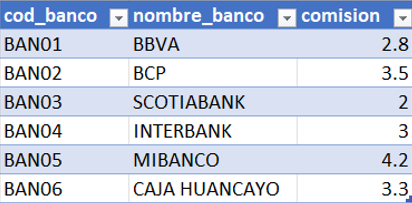

7.  La metadata y/o lectura del archivo plano donde se encuentra almacenado las ventas realizadas, estos puntos son los siguientes para que tengan en consideración para su análisis.

  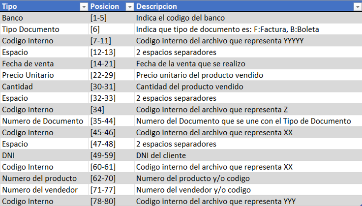

### 1.4. Herramientas o Tecnologías

No es necesario limitarse a las herramientas cubiertas en el curso, también puedes usar alternativas:

1.	Se requiere que hagan el modelo dimensional, Dashboard
    - ETL (Puede ser por Integration Service), Power Query, Excel, ...
    - Analysis Service (MDX), Power pivot, Power BI (DAX), ...
    - Visualización (En cualquier programa que saben utilizar más).
2.	Se considera el aporte a estrategias de mejora.
3.  Se considera otros métodos adicionales de aporte o complementario al proyecto.
4.  Si usan alguna herramienta que no se cubrió en el curso, asegurarse de explicar qué hace la herramienta.

### 1.5. Entregables

Para el proyecto, su repositorio/carpeta debe contener lo siguiente:

1. README.md con:
    - Descripción del problema
    - Instrucciones de cómo correr el proyecto.
2. Data
    - Debe contener el conjunto de datos que utilizó, o tener instrucciones claras sobre cómo descargar el conjunto de datos.
3. Archivos
    - Archivos donde se generó el ETL, SSIS, SSAS, Power BI u otros.
4. Conclusiones
    - El repositorio debe contener resumen de la experiencia del proyecto, impedimentos, logros y comentarios adicionales por cada miembro del equipo.
    
---

## 2. Modelamiento

--

  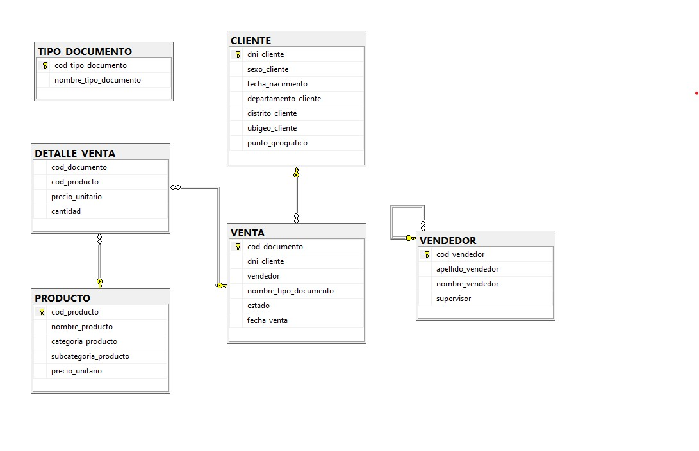

### 2.1. Modelo 1
--

### 2.2. Modelo 2

De acuerdo a la data de los Bancos, la tabla hechos <code>FACT_VENTA</code> debería tener los siguientes campos:

- cod_documento
- dni_cliente
- cod_vendedor
- nombre_tipo_documento
- fecha_venta
- cod_producto
- precio_unitario
- cantidad
- cod_banco

Por ello desnormalizé la tablas <code>DETALLE_VENTA</code> y  <code>VENTA</code>, convirtiendolas en la tabla hechos <code>FACT_VENTA</code>, para obtener un modelo entidad-relación como se muestra en la figura de abajo. 

La tabla <code>DIM_VENDEDOR</code> se podría relacionar con la tabla  <code>FACT_VENTA</code> mediante el campo vendedor, pero al hacer eso la tabla <code>DIM_VENDEDOR</code> mostraría sus resultados ordenados por el nombre del vendedor, para evitar ese problema y mostrar la tabla
<code>DIM_VENDEDOR</code> de acuerdo a su codigo, decidí no relacionarlo directamente.

  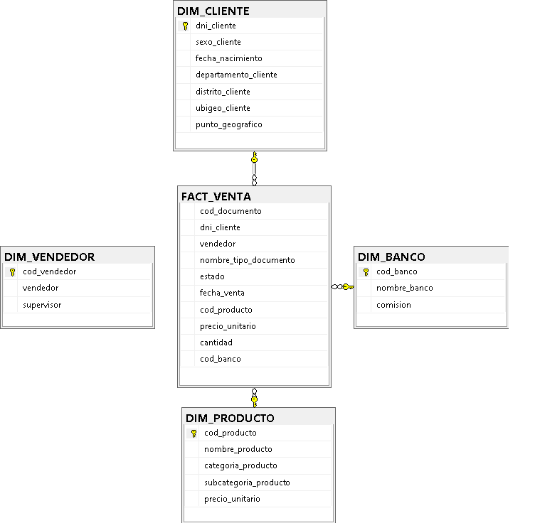

Para obtener el modelo entidad-relación mostrado, primero se tiene que restaurar la siguiente base de datos [`SUPERMAYORISTA.bak`](Data\SUPERMAYORISTA.bak), luego de ello se tiene que correr el siguiente script en el SQL Server [`Create_Data_Warehouse.sql`](Modelamiento\2_Modelo\Create_Data_Warehouse.sql)

## 3. Carga incremental

### 3.1. SQL Server Integration Services - SSIS
--

### 3.2. Python

Para poder hacer la carga incremental con python, primero debemos hacer el modelamiento planteado en el punto [2.2. Modelo 2](#22-modelo-2), y mantener el servidor abierto. 

Antes de avanzar, echemos un primer vistazo a la cantidad de  filas que tiene nuestra tabla hechos <code>FACT_VENTA</code>, 

  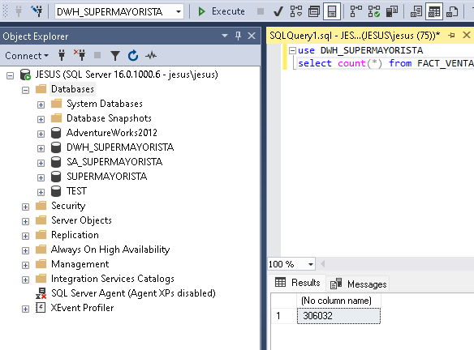

Para continuar, debemos instalar algunas librerías que necesita el script de python, tales como:

- pyodbc(Windows) 
- numpy
- pandas
- sqlalchemy

En la consola tipear:

    pip install pyodbc numpy pandas sqlalchemy

  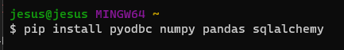

Luego correr el código [ETL_01.py](Carga_Incremental\Python\ETL_01.py), este script de python toma parámetros de entrada los siguientes valores:
  - name: nombre de tu usuario del sql server
  - database: nombre de la base de datos
  - path: dirección donde estan los archivos txt de los Bancos
  - driver: versión del ODBC
  
  Para saber que version del  ODBC tienes, tipear ODBC en el buscador de Windows, para mi caso es el ODBC Driver 17 for SQL Server 

  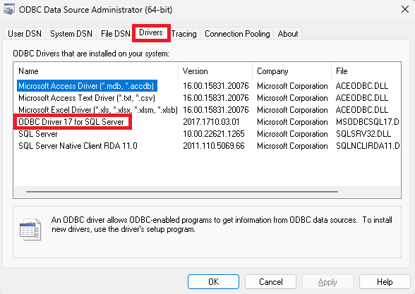

Este es el codigo para mi caso, solo cambiarlo con tus parámetros:

    python ETL_01.py \
    --name jesus \
    --database DWH_SUPERMAYORISTA \
    --path /c/Users/jesus/Desktop/data-analyst-project/proyecto-supermayorista/Bancos \
    --driver 17

  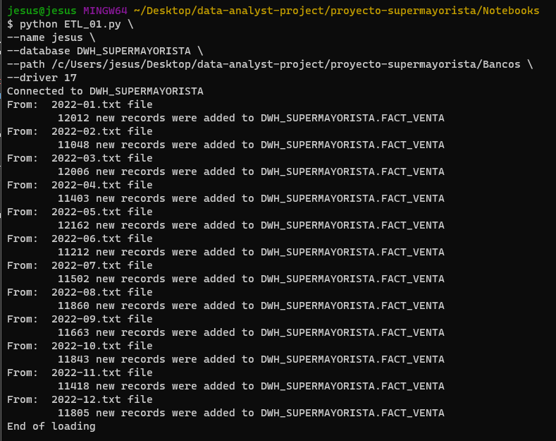

Ahora echemos un segundo vistazo a la cantidad de  filas que tiene nuestra tabla hechos <code>FACT_VENTA</code>.

  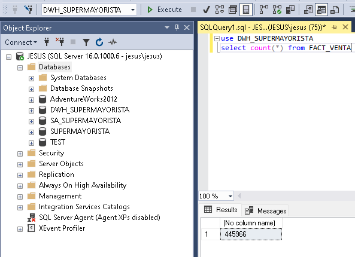

## 4. Dashboard

### 4.1. Power BI
--

### 4.2. Looker Studio

Para hacer el dashboard con Looker Studio me apoyé de consultas hechas
en jupyter notebook, empleando la librería de pandas. Esas consultas son tablas que luego las envié a Big Query, para luego hacer una conexión con Looker Studio.

1. Paso

Para poder replicar este paso, primero tienes que crearte una cuenta en Google Cloud Platform y luego crear un proyecto, acá hay un tutorial para poder realizarlo [CREAR PROYECTO GCP](crear_proyecto_gcp.md)

2. Paso

Luego se necesita crear una <code>service account</code>, para poder tener los permisos necesarios para poder crear las tablas en Big Query de forma remota, en el siguiente link están los pasos para crear una <code>service account</code> [CREAR SERVICE ACCOUNT](crear_service_account.md)

3. Paso

Seleccionar el servicio de Big Query en Google Cloud Platform y crear una base de datos llamada dwh_queries y correr el codigo del notebook [Queries.ipynb](Dashboard\Looker_Studio\Queries.ipynb), en ese notebook se tiene que configurar la ruta de la key generada en el Paso 2, también el nombre del server, base de datos de donde hacemos la consulta (SQL Server) como también el nombre del proyecto, base de datos y tablas del destino en Big Query

  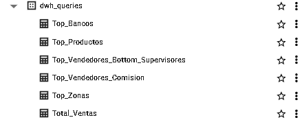

---

Por ejemplo para obtener el total de ventas por periodo, primero se hace la conexión con la base de datos DWH_SUPERMAYORISTA

  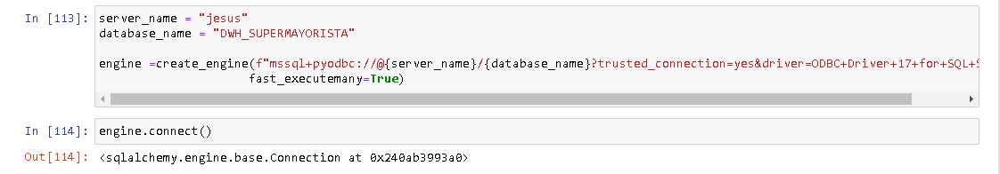

Segundo, se obtiene información de la tabla <code>FACT_VENTA</code>

  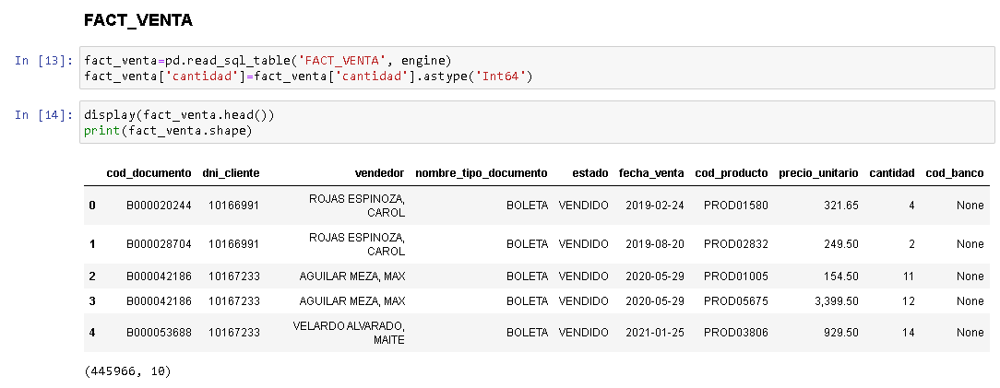

Tercero, se obtiene transformación de la tabla <code>FACT_VENTA</code> para obtener el total de ventas agrupado por meses

  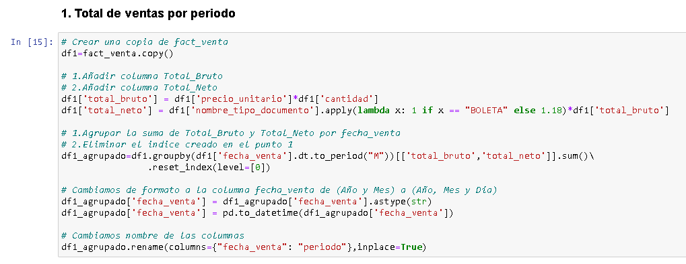

  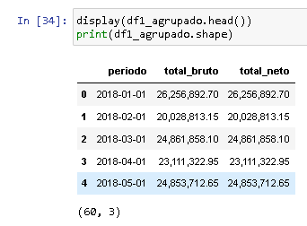

Cuarto, se envía esa tabla a Big Query como Total_Ventas 

  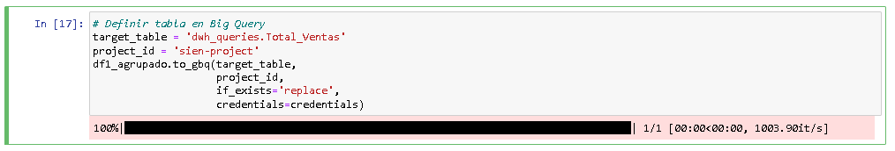

Y asi sucesivamente con las demás consultas. Finalmente se puede hacer la conexión entre Big Query y Looker Studio, para proceder con la creación del dashboard.

  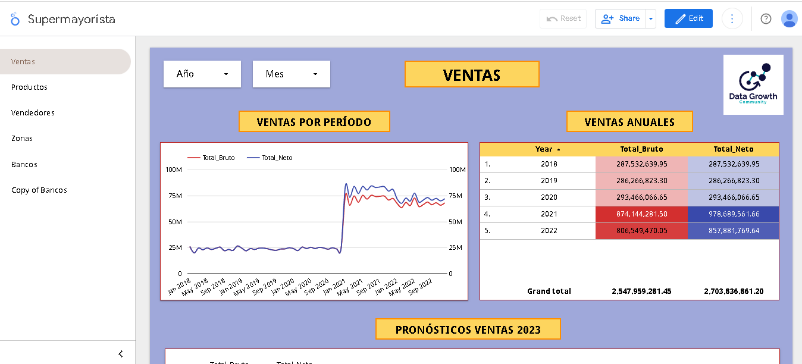

Pueden echarle un vistazo aqui:

> https://lookerstudio.google.com/reporting/fd2e4a7a-a0fd-4f1a-9939-4ad7f0fcba00

## 5. Conclusiones

- 

